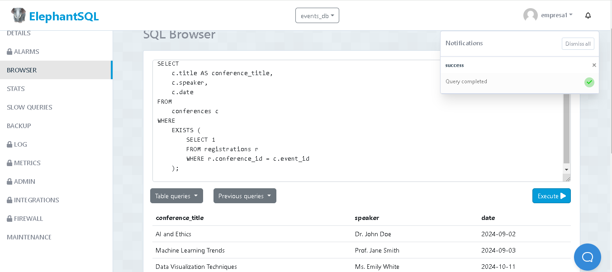

 1.-El numero total de facturas realizadas por cada cliente.
          nombre_cliente | direccion | nro_facturas
SELECT c.full_name AS nombre_cliente, c.address AS direccion, 
       (SELECT COUNT(*) FROM invoice WHERE client_id = c.id) AS nro_facturas
FROM client c;
 (SELECT AVG(total) FROM invoice);
<img src="" 

4.- DB EVENT

Crear dos ejemplo con la base de datos event. Uno con subconsulta en SELECT y otro con subconsulta  en WHERESELECT
    c.title AS conference_title,
    (
        SELECT string_agg(m.first_name || ' ' || m.last_name, ', ')
        FROM registrations r
        JOIN members m ON r.member_id = m.member_id
        WHERE r.conference_id = c.event_id
    ) AS member_names
FROM
    conferences c;

<img src="" 

WHERE
SELECT
    c.title AS conference_title,
    c.speaker,
    c.date
FROM
    conferences c
WHERE
    EXISTS (
        SELECT 1
        FROM registrations r
        WHERE r.conference_id = c.event_id
    );

<img src=""

